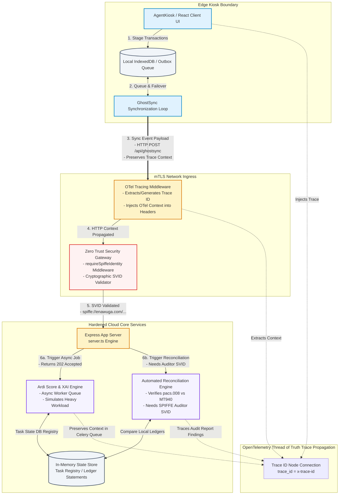

# Enawuga Phygital Nexus — System Architecture

This document outlines the enterprise-grade architecture of the **Enawuga Phygital Nexus** platform. It visually represents the interaction of our resilience triad: **Observability (OpenTelemetry)**, **Scalability (Async Workers & GhostSync)**, and **Integrity (Zero Trust SPIFFE/SVID identity propagation)**.

---

## 1. System Architecture Diagram (Mermaid.js)

---

## 2. Key Pillars of the Architecture

### A. OpenTelemetry Distributed Tracing Flow
The **OpenTelemetry (OTel)** environment weaves a continuous thread of truth from the client's action down to asynchronous background job execution:
1. **Context Extraction/Creation:** Every request is captured by the OTel distributed tracing middleware in `server.ts`. Incoming headers are inspected for an existing trace context (`x-trace-id`). If none exists, a fresh 16-byte cryptographically-secure `traceId` and an 8-byte `spanId` are generated.
2. **Propagation:** Downstream activities (e.g., job registrations, database transactions) store the trace ID directly. Even async processes queued to the mock Celery worker pool bind their database execution records (`db.tasks[jobId]`) to their active `trace_id`.
3. **Closing the Span:** Once a background process completes or an HTTP request finishes, logs are printed using unified formats (`[OTel Worker | Trace: <id>] ...`), establishing visible spans which help trace network discrepancies and failures.

### B. SPIFFE/SPIRE Identity Boundaries (Zero Trust)
To secure the communications from endpoints inside our network, the system uses implicit verification instead of assuming network-location security:
1. **SPIFFE SVID Token Format:** Identity is encapsulated in a JWT-like **SVID (SPIFFE Verifiable Identity Document)** token passed inside the header: `x-spiffe-svid`.
2. **Cryptographic Filtering:** The `requireSpiffeIdentity` middleware decodes this SVID token, verifies its signature integrity, compares transaction expiration (`expires_at`), and checks the subject identity (e.g. `spiffe://enawuga.com/ns/governance/sa/auditor`).
3. **Fail-Closed Principle:** Unauthorized SVID entries or signature mismatches trigger immediate `401 ZERO_TRUST_VIOLATION` or `403 ZERO_TRUST_VIOLATION` failures, keeping the inner processing pipelines cleanly insulated.

### C. GhostSync Offline-First Decoupling Strategy
The **GhostSync** sync bridge ensures that transactions can withstand complete network partition events:
1. **Localized Buffers:** Transactions initiated during offline states are captured inside local queues (e.g., LocalStorage/IndexedDB) rather than erroring out the user interface.
2. **Synthetic Partition Triggering:** The UI allows triggering chaos simulations (`CHAOS_NETWORK_PARTITION`), verifying that the system successfully registers offline transactions and delays synchronizations gracefully.
3. **Trace-Preserved Reconnect:** When normal communication routes are restored, buffered transactions are uploaded dynamically to our Express Ingress, mapping their origin points back into the central distributed traces on the server.

---

## 3. Resilience Triad Validation Scenarios

| Testing Scenario | Fault Injected | Expected Behaviour | Observability Output |
| :--- | :--- | :--- | :--- |
| **SVID Expiration (Chaos)** | SVID Token with `expires_at` in the past | **Fail-Closed:** Ingress rejects the payload before passing it to the Bank Reconciliation Engine. | Middleware logs `401 ZERO_TRUST_VIOLATION`, tracing the invalid context in OTel but blocking execution. |
| **Network Partition (Chaos)** | `CHAOS_NETWORK_PARTITION` flag active | **State Buffering:** UI switches gracefully into off-grid states; transactions queue locally; no system crash. | App status switches to Offline. Sync requests block internally, maintaining local consistency. |
| **High Load Saturation** | Torrent of mock credit requests | **Asynchronous Decoupling:** Main event loop remains unblocked by returning `202 QUEUED` to the client instantly. | Worker logs dequeue signals asynchronously (`[OTel Worker]`), tracking each task's lifetime. |
